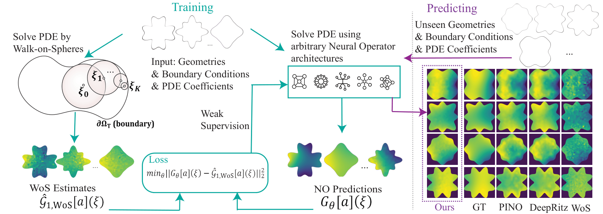

<div align="center">

<div id="user-content-toc">
  <ul align="center" style="list-style: none;">
    <summary>
      <h1>WoS-NO: Walk-on-Spheres Neural Operator</h1>
    </summary>
  </ul>
</div>

<p align="center">
  <em>Mesh-free, Data-free Training of Neural Operators via Monte Carlo Weak Supervision</em>
</p>

<a href="https://www.python.org/"></a> &emsp;
<a href="https://pytorch.org/"></a> &emsp;
<a href="https://fenicsproject.org/"></a> &emsp;
<a href="https://wandb.ai/"></a> &emsp;
<a href="LICENSE"></a>

<br><br>

<br>
<em>The WoS-NO Pipeline leveraging stochastic random walks for weak supervision.</em>
<br><br>

<div id="toc">
  <ul align="center" style="list-style: none;">
    <summary>
      <h2><a href="#overview">Overview</a> &emsp; <a href="https://drive.google.com/drive/folders/1zaRLzJMytxhpC7bulmnKntqy9SuPArXt?usp=sharing">Data & Weights</a> &emsp; <a href="#quick-start">Quick Start</a></h2>
    </summary>
  </ul>
</div>

</div>

---

## 📖 Overview

Training neural PDE solvers is often bottlenecked by expensive data generation or unstable physics-informed neural network (PINN) that involves challenging optimization landscapes due to higher-order derivatives. To tackle this issue, we propose an alternative approach using Monte Carlo approaches to estimate the solution to the PDE as a stochastic process for weak supervision during training.

Recently, an efficient discretization-free Monte-Carlo algorithm called **Walk-on-Spheres (WoS)** has been popularized for solving PDEs using random walks. Leveraging this, we introduce a learning scheme called **Walk-on-Spheres Neural Operator (WoS-NO)** which uses weak supervision from WoS to train any given neural operator. 

The central principle of our method is to amortize the cost of Monte Carlo walks across the distribution of PDE instances. Our method leverages stochastic representations using the WoS algorithm to generate cheap, noisy, yet unbiased estimates of the PDE solution during training. This is formulated into a data-free physics-informed objective where a neural operator is trained to regress against these weak supervisions. Leveraging the unbiased nature of these estimates, the operator learns a generalized solution map for an entire family of PDEs.

This strategy results in a **mesh-free framework** that operates without expensive pre-computed datasets, avoids the need for computing higher-order derivatives for loss functions that are memory-intensive and unstable, and demonstrates zero-shot generalization to novel PDE parameters and domains. Experiments show that for the same number of training steps, our method exhibits up to **8.75× improvement in $L_2$-error** compared to standard physics-informed training schemes, up to **6.31× improvement in training speed**, and reductions of up to **2.97× in GPU memory consumption**.

<div align="center">
  
  <br>
  <em>Figure 1: The WoS-NO Pipeline leveraging stochastic random walks for weak supervision.</em>
</div>

---

## 🛠️ Tech Stack & Requirements

This project relies on a specific stack of scientific computing libraries. Key dependencies include:

| Component | Library |
| :--- | :--- |
| **Deep Learning** |    |
| **PDE Solving** |    |
| **Config/Logs** |   |
| **Acceleration** |    |

---

## 💾 Data

The datasets required for training and evaluation are available via Google Drive.

[](https://drive.google.com/drive/folders/1zaRLzJMytxhpC7bulmnKntqy9SuPArXt?usp=sharing)

---

## ⚙️ Installation

The installation process involves setting up a Conda environment for FEniCS and compiling custom C++ bindings for the Walk-on-Spheres solver.

### 1. System Dependencies (Linux)
```bash
sudo apt-get update
sudo apt-get install -y gcc-10 g++-10 libboost-iostreams-dev libtbb-dev libblosc-dev
```
### 2. Environment Setup
Create the environment using Conda (using libmamba solver is recommended for speed):

```Bash

conda create -n MCGINO -c conda-forge python=3.10 fenics=2019.1.0 mshr=2019.1.0 --solver=libmamba
conda activate MCGINO
```
### 3. Build Custom Bindings (OpenVDB & Zombie)
Set your compiler variables:

```Bash

export CC=gcc-10
export CXX=g++-10
Build OpenVDB:
```
```Bash

cd lib/openvdb
mkdir -p build && cd build
cmake .. -D OPENVDB_BUILD_PYTHON_MODULE=ON -D USE_NUMPY=ON
sudo make install
cd ../../..
Build Solver Bindings:
```
```Bash

cd bindings/zombie
mkdir -p build && cd build
cmake ..
make -j4
# Move the compiled library to the source folder
cp zombie_bindings.cpython-310-x86_64-linux-gnu.so ../../../src/solvers/wos/
cd ../../..
```

### 4. Python Dependencies
Install NeuralOperator and other requirements:


### Install NeuralOperator from source
```bash
git clone [https://github.com/NeuralOperator/neuraloperator](https://github.com/NeuralOperator/neuraloperator)
cd neuraloperator
pip install -e .
cd ..
```

## Install PyTorch and Scatter (Ensure CUDA 12.6 compatibility)
### Adjust the URL based on your specific CUDA version if needed
```bash
pip install torch torchvision torchaudio --index-url [https://download.pytorch.org/whl/cu126](https://download.pytorch.org/whl/cu126)
pip install torch-scatter -f [https://data.pyg.org/whl/torch-2.6.0+cu126.html](https://data.pyg.org/whl/torch-2.6.0+cu126.html)
```
### Install remaining python requirements
```bash
pip install wandb hydra-core==1.3.2 hydra-submitit-launcher==1.2.0 torch_harmonics==0.8.0 jax pyparsing
```
🚀 Usage
Before running, ensure you have set up your CUDA environment variables:

```Bash

export CUDA_HOME=/usr/local/cuda-12.6
export PATH=$CUDA_HOME/bin:$PATH
export LD_LIBRARY_PATH=$CUDA_HOME/lib64:$LD_LIBRARY_PATH
```

> [!WARNING]
> Important Config Note: Please search for the string ```hong``` in the codebase and replace corresponding directory paths with your local absolute paths before initiating training.

Training in 2D
To train the model on the 2D Linear Poisson dataset using the Walk-on-Spheres loss:

```Bash

python -m scripts.main \
    loss=wos \
    model=gino \
    dataset=linear_poisson2d \
    train=wos \
    solver=wos2d
```
Training in 3D (Experimental)
To train on the 3D dataset:

```Bash

python -m scripts.main \
    loss=wos3d \
    model=gino3d \
    dataset=linear_poisson3d \
    train=wos3d \
    solver=wos3d
```
> [!NOTE]
> Regarding train=wos: Always pass the train=wos (or wos3d) flag if you do not want to compute the gradient with respect to inputs (BVC). Omitting it will result in significantly higher memory usage.

🐛 Known Issues
3D Stability: The 3D implementation has not been extensively tested and may require hyperparameter tuning.

2D BVC: Boundary Value Correction (BVC) in 2D is currently unstable.

📜 Citation
If you use this code for your research, please cite our work:

```Code snippet

@article{viswanath2026operator,
  title={Operator Learning Using Weak Supervision from Walk-on-Spheres},
  author={Viswanath, Hrishikesh and Nam, Hong Chul and Deng, Xi and Berner, Julius and Anandkumar, Anima and Bera, Aniket},
  journal={arXiv preprint arXiv:2603.01193},
  year={2026}
}
```
</div>
